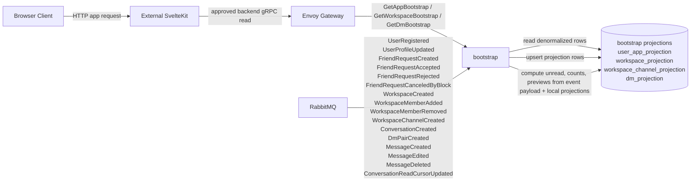

```mermaid
flowchart LR
    Client[Browser Client]
    App[External SvelteKit]
    Gateway[Envoy Gateway]
    Bootstrap[bootstrap]
    RabbitMQ[RabbitMQ]
    Projections[(bootstrap projections\nuser_app_projection\nworkspace_projection\nworkspace_channel_projection\ndm_projection)]

    Client -->|HTTP app request| App
    App -->|approved backend gRPC read| Gateway
    Gateway -->|GetAppBootstrap / GetWorkspaceBootstrap / GetDmBootstrap| Bootstrap
    Bootstrap -->|read denormalized rows| Projections

    RabbitMQ -->|UserRegistered\nUserProfileUpdated\nFriendRequestCreated\nFriendRequestAccepted\nFriendRequestRejected\nFriendRequestCanceledByBlock\nWorkspaceCreated\nWorkspaceMemberAdded\nWorkspaceMemberRemoved\nWorkspaceChannelCreated\nConversationCreated\nDmPairCreated\nMessageCreated\nMessageEdited\nMessageDeleted\nConversationReadCursorUpdated| Bootstrap
    Bootstrap -->|upsert projection rows| Projections
    Bootstrap -->|compute unread, counts, previews from event payload + local projections| Projections
```
