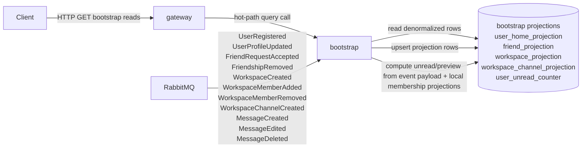

```mermaid
flowchart LR
    Client[Client]
    Gateway[gateway]
    Bootstrap[bootstrap]
    RabbitMQ[RabbitMQ]
    Projections[(bootstrap projections\nuser_home_projection\nfriend_projection\nworkspace_projection\nworkspace_channel_projection\nuser_unread_counter)]

    Client -->|HTTP GET bootstrap reads| Gateway
    Gateway -->|hot-path query call| Bootstrap
    Bootstrap -->|read denormalized rows| Projections

    RabbitMQ -->|UserRegistered\nUserProfileUpdated\nFriendRequestAccepted\nFriendshipRemoved\nWorkspaceCreated\nWorkspaceMemberAdded\nWorkspaceMemberRemoved\nWorkspaceChannelCreated\nMessageCreated\nMessageEdited\nMessageDeleted| Bootstrap
    Bootstrap -->|upsert projection rows| Projections
    Bootstrap -->|compute unread/preview from event payload + local membership projections| Projections
```
