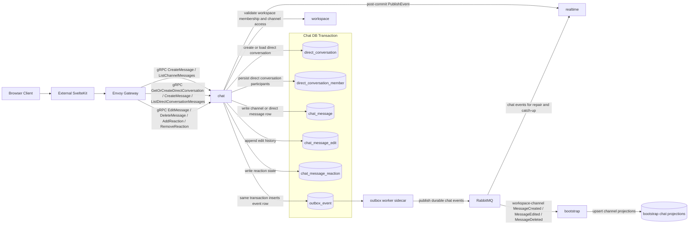

## Chat Data Communication Diagram

Notes:

- Envoy Gateway owns backend ingress policy; chat owns durable message, edit, delete, and reaction invariants plus service-boundary authorization.
- Workspace-channel writes and reads depend on workspace-owned membership and channel validation before chat accepts them.
- Chat also owns direct-message conversation metadata and participant membership used to authorize DM reads and writes.
- Chat writes domain rows and `outbox_event` rows in the same local Postgres transaction.
- Channel message fanout and direct-message fanout both call `realtime.PublishEvent` only after durable write success and remain best-effort for latency.
- RabbitMQ publication is the durable path for downstream convergence, replay, and recovery when synchronous fanout is unavailable.
- `workspace` is shown as a contract dependency for validation only; chat still owns message persistence and never writes workspace data.
