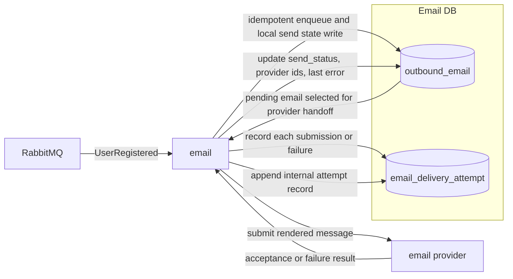

## Email Data Communication Diagram

Notes:

- RabbitMQ is the durable trigger source; email does not read identity or workspace databases directly.
- Email persists local send state before and after provider handoff so retries and operator inspection stay service-owned.
- `email_delivery_attempt` is an internal operational record, not a published v1 event stream.
