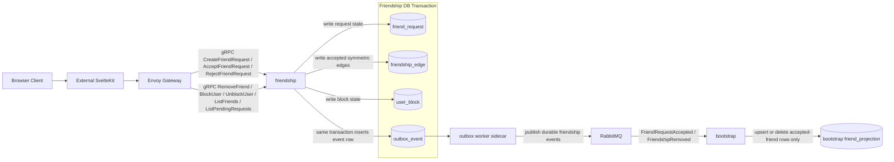

## Friendship Data Communication Diagram

Notes:

- Envoy Gateway owns backend ingress policy; friendship owns relationship state, invariants, and service-boundary authorization.
- Friendship writes domain rows and `outbox_event` rows in the same local Postgres transaction.
- RabbitMQ publication is asynchronous and is the durable path that lets `bootstrap` converge accepted-friend projections after friendship writes.
- V1 bootstrap scope here is accepted-friend projection maintenance only; pending-request and block state remain friendship-owned and are not projected by bootstrap.
- `BlockUser` may write `user_block`, resolve pending requests, remove friendship edges, and enqueue multiple outbox events in one transaction.
