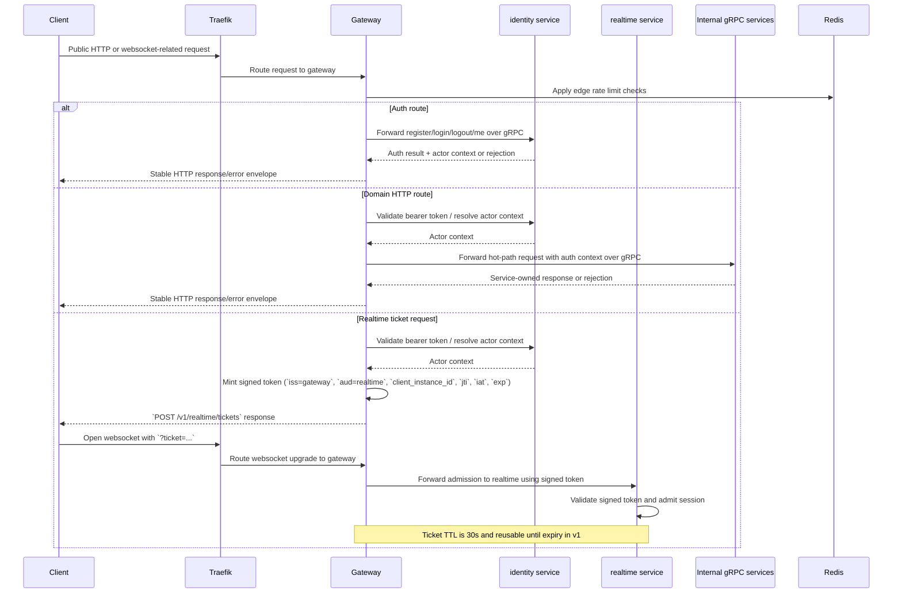

```mermaid
sequenceDiagram
    participant Client
    participant Traefik
    participant Gateway
    participant Identity as identity service
    participant Realtime as realtime service
    participant Other as Internal gRPC services
    participant Redis

    Client->>Traefik: Public HTTP or websocket-related request
    Traefik->>Gateway: Route request to gateway
    Gateway->>Redis: Apply edge rate limit checks

    alt Auth route
        Gateway->>Identity: Forward register/login/logout/me over gRPC
        Identity-->>Gateway: Auth result + actor context or rejection
        Gateway-->>Client: Stable HTTP response/error envelope
    else Domain HTTP route
        Gateway->>Identity: Validate bearer token / resolve actor context
        Identity-->>Gateway: Actor context
        Gateway->>Other: Forward hot-path request with auth context over gRPC
        Other-->>Gateway: Service-owned response or rejection
        Gateway-->>Client: Stable HTTP response/error envelope
    else Realtime ticket request
        Gateway->>Identity: Validate bearer token / resolve actor context
        Identity-->>Gateway: Actor context
        Gateway->>Gateway: Mint signed token (`iss=gateway`, `aud=realtime`, `client_instance_id`, `jti`, `iat`, `exp`)
        Gateway-->>Client: `POST /v1/realtime/tickets` response
        Client->>Traefik: Open websocket with `?ticket=...`
        Traefik->>Gateway: Route websocket upgrade to gateway
        Gateway->>Realtime: Forward admission to realtime using signed token
        Realtime->>Realtime: Validate signed token and admit session
        Note over Gateway,Realtime: Ticket TTL is 30s and reusable until expiry in v1
    end
```
