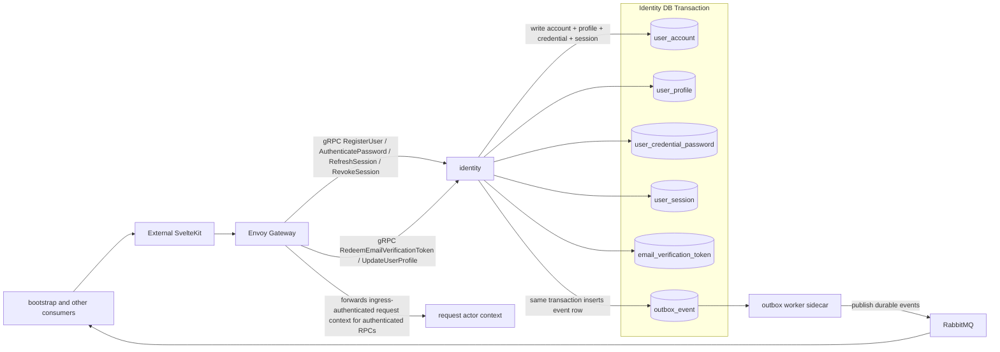

## Identity Data Communication Diagram

Notes:

- Envoy Gateway owns backend ingress policy, validates short-lived access JWTs on protected routes, and forwards authenticated request context where required.
- `RegisterUser`, `AuthenticatePassword`, `RefreshSession`, and `RedeemEmailVerificationToken` are auth-entry RPCs; protected actor context applies to profile-bound calls only.
- Identity writes domain rows and `outbox_event` rows in the same local Postgres transaction, including initial email verification token issuance and profile/email-verification updates.
- RabbitMQ publication is asynchronous and does not replace the synchronous token-pair or profile result returned to the external caller through Envoy Gateway.
