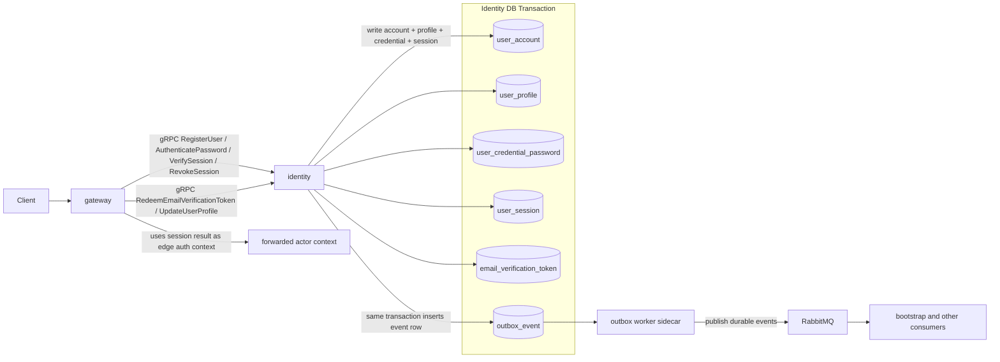

## Identity Data Communication Diagram

Notes:

- `gateway` owns the public auth edge but not account or session persistence.
- Identity writes domain rows and `outbox_event` rows in the same local Postgres transaction, including initial email verification token issuance and profile/email-verification updates.
- RabbitMQ publication is asynchronous and does not replace the synchronous registration or session result returned to `gateway`.
