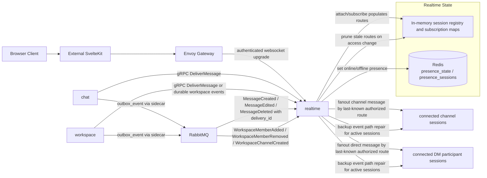

## Realtime Data Communication Diagram

Notes:

- `chat -> realtime` gRPC `DeliverMessage` is low-latency path for already committed writes.
- Envoy Gateway is the backend ingress and policy boundary for websocket attach; realtime still owns connected-session routing and delivery behavior.
- Routing state is ephemeral and populated by websocket attach/subscribe after auth; stale routes are pruned when upstream ownership changes converge.
- RabbitMQ consumption is the backup and recovery path when direct fanout fails or is delayed for active sessions.
- Full reconnect history catch-up is not performed by realtime; clients must reload from chat/bootstrap reads after reconnect.
- Redis is the primary v1 presence store; realtime stays stateless beyond routing and presence.
- Realtime owns websocket delivery and presence only; it does not become the durable message authority.
