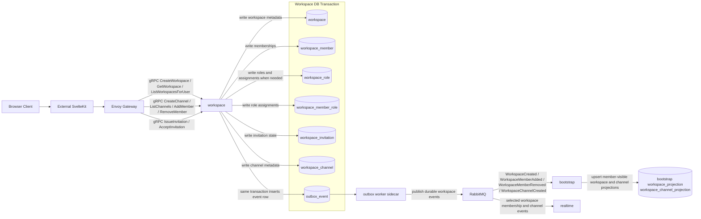

## Workspace Data Communication Diagram

Notes:

- Envoy Gateway owns backend ingress policy; workspace owns membership, invitation, role, channel-metadata invariants, and service-boundary authorization.
- Workspace writes domain rows and `outbox_event` rows in the same local Postgres transaction.
- RabbitMQ publication is asynchronous and is the durable path that lets `bootstrap` and `realtime` converge after workspace writes.
- `chat` is intentionally absent from this diagram because workspace owns channel metadata and membership, not message persistence.
- Invitation acceptance can emit both `WorkspaceInvitationAccepted` and `WorkspaceMemberAdded` from one transaction so audit and projection consumers can converge independently.
