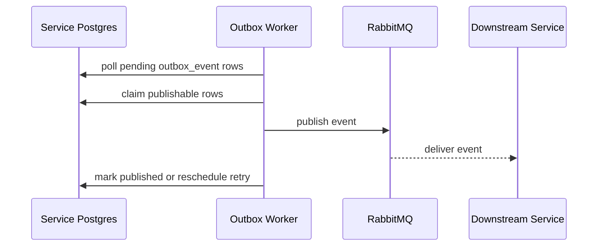
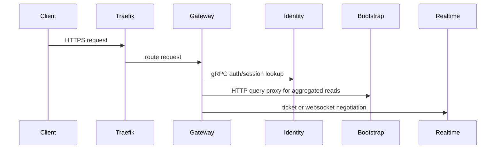
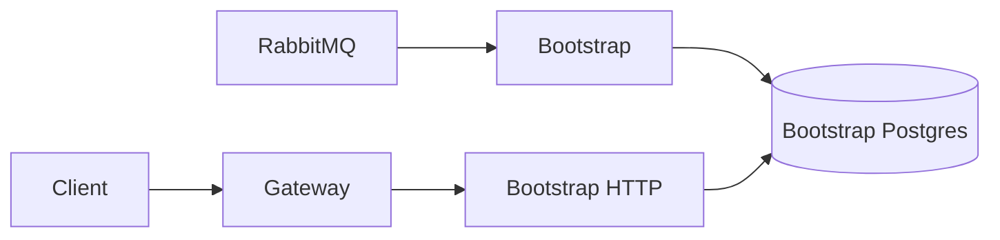
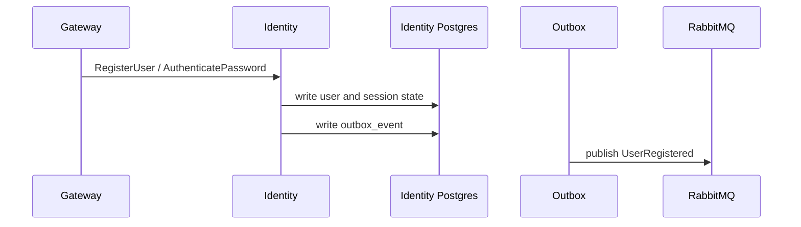
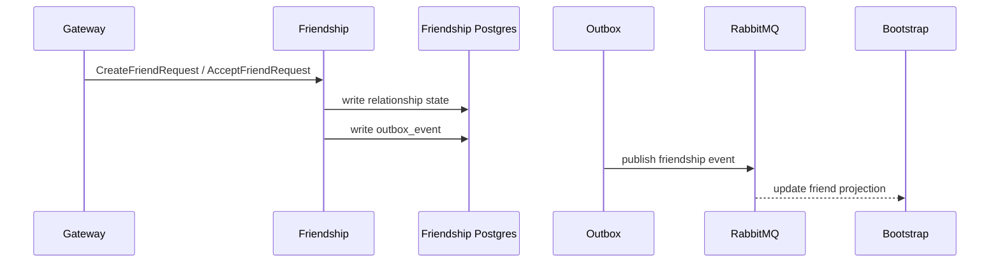
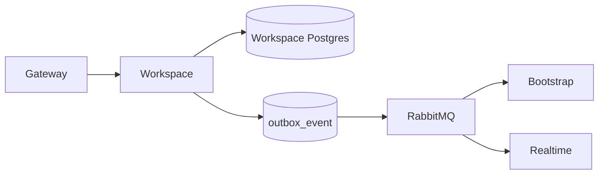
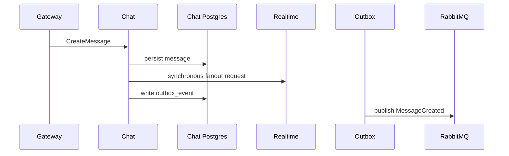
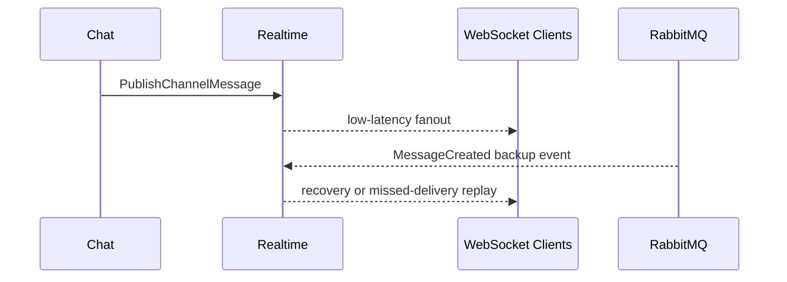
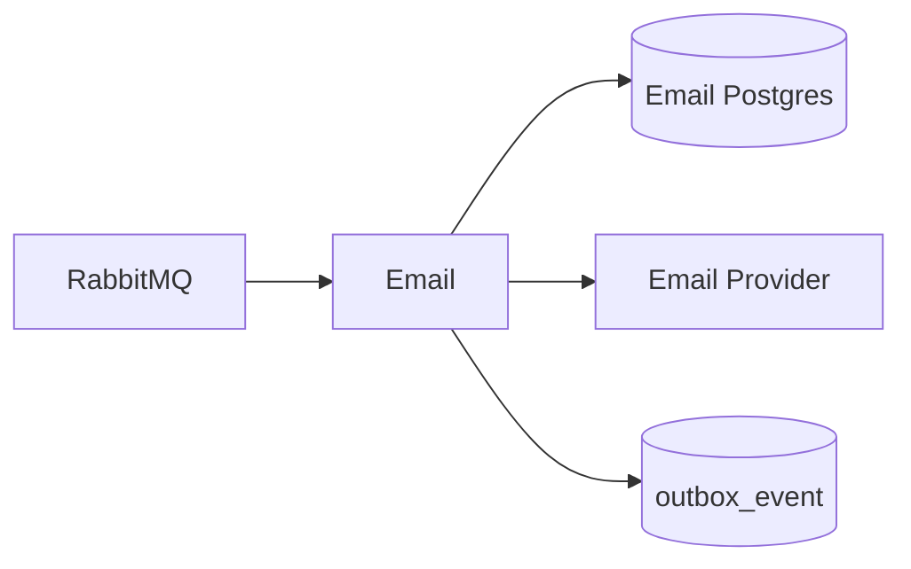

# Microservice Contract Documentation Implementation Plan

> **For agentic workers:** REQUIRED SUB-SKILL: Use superpowers:subagent-driven-development (recommended) or superpowers:executing-plans to implement this plan task-by-task. Steps use checkbox (`- [ ]`) syntax for tracking.

**Goal:** Build the first authoritative documentation set for this Discord-like microservices project, covering global architecture rules, per-service contracts, a shared outbox worker contract, and implementation roadmaps.

**Architecture:** The documentation will be written service-first, with one folder per service under `docs/service/` and one shared worker contract under `docs/workers/outbox-worker/`. Global files will capture architecture rules and cross-service delivery order, while each service folder will define data ownership, sync and async contracts, user stories, data communication diagrams, and an implementation roadmap.

**Tech Stack:** Markdown, OpenAPI 3.1 YAML, Mermaid, PostgreSQL contract design, gRPC contract design, RabbitMQ event contracts, Traefik edge routing, Kubernetes via kind, Rust-oriented microservice conventions

---

## File Structure

### Global files

- Create: `AGENTS.md`
  - Core memory for future agents, including project rules, collaboration expectations, and architecture constraints.
- Create: `docs/architecture.md`
  - Shared platform architecture covering hot path, cold path, Postgres ownership, RabbitMQ, Traefik, kind, Redis policy, and outbox sidecar rules.
- Create: `docs/roadmap.md`
  - Cross-service delivery order and milestone sequencing.

### Shared worker files

- Create: `docs/workers/outbox-worker/README.md`
  - Shared sidecar worker overview, responsibilities, and deployment model.
- Create: `docs/workers/outbox-worker/data-model.md`
  - Canonical `outbox_event` schema semantics shared by all services.
- Create: `docs/workers/outbox-worker/events.md`
  - Delivery behavior, publish retry expectations, and consumer idempotency contract.
- Create: `docs/workers/outbox-worker/diagram.md`
  - Mermaid data communication diagram for local DB polling, publish, retry, and ack flow.
- Create: `docs/workers/outbox-worker/roadmap.md`
  - Implementation order for the outbox worker sidecar pattern.

### Service files

- Create: `docs/service/gateway/README.md`
- Create: `docs/service/gateway/data-model.md`
- Create: `docs/service/gateway/openapi.yml`
- Create: `docs/service/gateway/events.md`
- Create: `docs/service/gateway/diagram.md`
- Create: `docs/service/gateway/user-story.md`
- Create: `docs/service/gateway/roadmap.md`

- Create: `docs/service/bootstrap/README.md`
- Create: `docs/service/bootstrap/data-model.md`
- Create: `docs/service/bootstrap/openapi.yml`
- Create: `docs/service/bootstrap/events.md`
- Create: `docs/service/bootstrap/diagram.md`
- Create: `docs/service/bootstrap/user-story.md`
- Create: `docs/service/bootstrap/roadmap.md`

- Create: `docs/service/identity/README.md`
- Create: `docs/service/identity/data-model.md`
- Create: `docs/service/identity/grpc.md`
- Create: `docs/service/identity/events.md`
- Create: `docs/service/identity/diagram.md`
- Create: `docs/service/identity/user-story.md`
- Create: `docs/service/identity/roadmap.md`

- Create: `docs/service/friendship/README.md`
- Create: `docs/service/friendship/data-model.md`
- Create: `docs/service/friendship/grpc.md`
- Create: `docs/service/friendship/events.md`
- Create: `docs/service/friendship/diagram.md`
- Create: `docs/service/friendship/user-story.md`
- Create: `docs/service/friendship/roadmap.md`

- Create: `docs/service/workspace/README.md`
- Create: `docs/service/workspace/data-model.md`
- Create: `docs/service/workspace/grpc.md`
- Create: `docs/service/workspace/events.md`
- Create: `docs/service/workspace/diagram.md`
- Create: `docs/service/workspace/user-story.md`
- Create: `docs/service/workspace/roadmap.md`

- Create: `docs/service/chat/README.md`
- Create: `docs/service/chat/data-model.md`
- Create: `docs/service/chat/grpc.md`
- Create: `docs/service/chat/events.md`
- Create: `docs/service/chat/diagram.md`
- Create: `docs/service/chat/user-story.md`
- Create: `docs/service/chat/roadmap.md`

- Create: `docs/service/realtime/README.md`
- Create: `docs/service/realtime/data-model.md`
- Create: `docs/service/realtime/grpc.md`
- Create: `docs/service/realtime/events.md`
- Create: `docs/service/realtime/diagram.md`
- Create: `docs/service/realtime/user-story.md`
- Create: `docs/service/realtime/roadmap.md`

- Create: `docs/service/email/README.md`
- Create: `docs/service/email/data-model.md`
- Create: `docs/service/email/events.md`
- Create: `docs/service/email/diagram.md`
- Create: `docs/service/email/user-story.md`
- Create: `docs/service/email/roadmap.md`

Repository note: the current workspace is not a git repository, so this plan uses file-content verification commands rather than commit steps.

### Task 1: Global Project Guidance And Architecture Docs

**Files:**
- Create: `AGENTS.md`
- Create: `docs/architecture.md`
- Create: `docs/roadmap.md`

- [ ] **Step 1: Write `AGENTS.md` with the project core memory**

```md
# AGENTS

## Project Identity
- Rust-heavy Discord-like microservices project
- Documentation-first repository until implementation is requested

## Architecture Rules
- Hot path uses gRPC
- Cold path uses RabbitMQ and eventual consistency
- Edge traffic goes through Traefik and gateway
- Local orchestration uses kind
- Each service owns its own Postgres database
- Redis is only for rate limiting or justified caching
- Outbox publishing uses a poll-based sidecar worker

## Working Rules For Agents
- Help and guide throughout the project lifetime
- Do not write application code unless clearly requested
- Documentation, tests, and infrastructure YAML are allowed
- Ask for clarification instead of assuming when uncertainty matters
- Preserve service ownership boundaries and shared documentation conventions
```

- [ ] **Step 2: Write `docs/architecture.md` with the shared platform contract**

```md
# Architecture

## System Shape
## Edge Path
## Hot Path
## Cold Path
## Data Ownership
## Shared Outbox Pattern
## Redis Usage Policy
## Local Kubernetes Topology
## Consistency Model
## Documentation Conventions
```

Required content to include in the sections above:
- Traefik routes external traffic to `gateway`
- `gateway` forwards sync calls to internal gRPC services
- `bootstrap` serves UI-facing aggregated queries from projections
- `chat` may synchronously notify `realtime` for low-latency fanout
- all durable cross-service propagation uses RabbitMQ via service-local `outbox_event`

- [ ] **Step 3: Write `docs/roadmap.md` with the global delivery sequence**

```md
# Global Roadmap

## Phase 1: Platform Foundations
## Phase 2: Identity And Access
## Phase 3: Friendship And Workspace Membership
## Phase 4: Chat Write Path And Realtime Delivery
## Phase 5: Bootstrap Query Projections
## Phase 6: Email And Operational Hardening
```

Each phase must list concrete deliverables, not generic goals. Include at least these items:
- kind cluster and local dependencies
- gateway and auth boundary
- per-service Postgres bootstrapping
- shared outbox worker pattern
- bootstrap projection build order

- [ ] **Step 4: Verify the global docs contain the required headings**

Run: `rg "^#|^##" AGENTS.md docs/architecture.md docs/roadmap.md`
Expected: matches for `# AGENTS`, `# Architecture`, `# Global Roadmap`, and the section headings defined in steps 1-3.

### Task 2: Shared Outbox Worker Contract

**Files:**
- Create: `docs/workers/outbox-worker/README.md`
- Create: `docs/workers/outbox-worker/data-model.md`
- Create: `docs/workers/outbox-worker/events.md`
- Create: `docs/workers/outbox-worker/diagram.md`
- Create: `docs/workers/outbox-worker/roadmap.md`

- [ ] **Step 1: Write `README.md` for the shared worker pattern**

```md
# Outbox Worker

## Purpose
## Deployment Model
## Responsibilities
## Non-Goals
## Configuration
## Failure Handling
## Relationship To Service Docs
```

The responsibilities section must say the worker is a reusable sidecar that polls a service-local `outbox_event` table and publishes to RabbitMQ.

- [ ] **Step 2: Write `data-model.md` with the canonical `outbox_event` contract**

```md
# Outbox Worker Data Model

## Shared Table
### outbox_event

| Column | Type | Notes |
| --- | --- | --- |
| event_id | uuid | Primary key and deduplication key |
| aggregate_type | text | Aggregate family |
| aggregate_id | uuid | Aggregate identifier |
| event_type | text | Domain event name |
| payload | jsonb | Event body |
| headers | jsonb | Correlation and trace metadata |
| status | text | `pending`, `claimed`, `published`, `failed` |
| publish_attempts | integer | Retry counter |
| occurred_at | timestamptz | Domain event time |
| available_at | timestamptz | Retry scheduling time |
| claimed_by | text | Worker identity |
| claimed_at | timestamptz | Claim time |
| published_at | timestamptz | Success time |
| last_error | text | Last publish error |
| created_at | timestamptz | Row creation time |
```

Include explicit notes for idempotency, retry safety, and why the schema semantics stay consistent across services.

- [ ] **Step 3: Write `events.md` with publish and consume guarantees**

```md
# Outbox Worker Event Contract

## Publisher Guarantees
## Consumer Expectations
## Idempotency Strategy
## Retry Semantics
## Failure Cases
```

Include these exact points:
- duplicate RabbitMQ delivery is possible
- consumers must deduplicate by `event_id`
- publisher retries must be safe after partial publish failures
- env-configurable polling cadence, batch size, and retry backoff must be documented

- [ ] **Step 4: Write `diagram.md` with the polling and publish flow**

```md
# Outbox Worker Diagram


```

- [ ] **Step 5: Write `roadmap.md` with the shared worker implementation order**

```md
# Outbox Worker Roadmap

1. Standardize `outbox_event` schema semantics across services.
2. Define worker polling, claiming, and retry environment variables.
3. Implement safe publish retry behavior and duplicate tolerance rules.
4. Document service integration points for writing outbox rows.
5. Document replay and recovery procedures.
```

- [ ] **Step 6: Verify the shared worker doc set**

Run: `rg --files docs/workers/outbox-worker && rg "outbox_event|Idempotency|Retry|mermaid" docs/workers/outbox-worker`
Expected: all five worker files exist and contain the shared schema, idempotency, retry, and Mermaid diagram content.

### Task 3: Gateway Service Contract Docs

**Files:**
- Create: `docs/service/gateway/README.md`
- Create: `docs/service/gateway/data-model.md`
- Create: `docs/service/gateway/openapi.yml`
- Create: `docs/service/gateway/events.md`
- Create: `docs/service/gateway/diagram.md`
- Create: `docs/service/gateway/user-story.md`
- Create: `docs/service/gateway/roadmap.md`

- [ ] **Step 1: Write `README.md` for the edge service boundary**

```md
# Gateway

## Purpose
## Owned Responsibilities
## Non-Goals
## Dependencies
## Storage
## HTTP Surface
## Asynchronous Interfaces
```

The owned responsibilities must say the gateway terminates public HTTP and WebSocket entrypoints, applies auth context, and forwards hot-path requests to internal services.

- [ ] **Step 2: Write `data-model.md` with the minimal gateway persistence contract**

```md
# Gateway Data Model

## Database Role
Gateway keeps only edge-operational state and does not own domain records.

## Tables
### gateway_idempotency_key
### gateway_websocket_ticket [NEEDS CLARIFICATION]

## Relations
## Cross-Service References
```

Use this direction:
- `gateway_idempotency_key` stores `key`, `actor_id`, `request_hash`, `response_status`, `expires_at`, `created_at`
- rate limiting stays in Redis and must not be modeled as Postgres ownership

- [ ] **Step 3: Write `openapi.yml` for the public edge routes**

```yaml
openapi: 3.1.0
info:
  title: Gateway API
  version: 0.1.0
paths:
  /v1/auth/register:
  /v1/auth/login:
  /v1/auth/logout:
  /v1/me:
  /v1/realtime/tickets:
```

Document request and response schemas for the routes above. In `POST /v1/realtime/tickets`, define the handshake contract used before a realtime connection is established.

- [ ] **Step 4: Write `events.md`, `diagram.md`, `user-story.md`, and `roadmap.md`**

```md
# Gateway Events

## Published Events
## Consumed Events
## Notes
```

```md
# Gateway Diagram


```

```md
# Gateway User Stories

- As a client, I can authenticate once and reuse edge-issued auth context on later requests.
- As a client, I can request a realtime connection ticket before opening a websocket session.
- As a client, I receive consistent HTTP error shapes when upstream services reject a request.
```

```md
# Gateway Roadmap

1. Define auth and error envelope contracts.
2. Define realtime ticket creation contract.
3. Add idempotency handling for selected mutating routes.
4. Document proxy boundaries and upstream ownership.
```

- [ ] **Step 5: Verify the gateway doc set**

Run: `rg --files docs/service/gateway && rg "Gateway API|gateway_idempotency_key|realtime/tickets|Gateway User Stories" docs/service/gateway`
Expected: seven gateway files exist and contain the edge routes, minimal persistence contract, and gateway user stories.

### Task 4: Bootstrap Service Contract Docs

**Files:**
- Create: `docs/service/bootstrap/README.md`
- Create: `docs/service/bootstrap/data-model.md`
- Create: `docs/service/bootstrap/openapi.yml`
- Create: `docs/service/bootstrap/events.md`
- Create: `docs/service/bootstrap/diagram.md`
- Create: `docs/service/bootstrap/user-story.md`
- Create: `docs/service/bootstrap/roadmap.md`

- [ ] **Step 1: Write `README.md` for the UI-facing query service**

```md
# Bootstrap

## Purpose
## Owned Read Models
## Non-Goals
## Dependencies
## Storage
## HTTP Surface
## Event Dependencies
```

The purpose section must explicitly say Bootstrap is a hot-path query service backed by eventually consistent projections.

- [ ] **Step 2: Write `data-model.md` for aggregated query projections**

```md
# Bootstrap Data Model

## Tables
### user_home_projection
### friend_projection
### workspace_projection
### workspace_channel_projection
### user_unread_counter

## Relations
## Projection Refresh Notes
```

For each table, document primary keys, projection keys, important indexes, and which upstream events maintain the projection.

- [ ] **Step 3: Write `openapi.yml` for the bootstrap read routes**

```yaml
openapi: 3.1.0
info:
  title: Bootstrap API
  version: 0.1.0
paths:
  /v1/bootstrap/home:
  /v1/bootstrap/friends:
  /v1/bootstrap/workspaces:
  /v1/bootstrap/workspaces/{workspaceId}/sidebar:
```

The response schemas must be denormalized, fast-to-render payloads intended to reduce N+1 frontend fetches.

- [ ] **Step 4: Write `events.md`, `diagram.md`, `user-story.md`, and `roadmap.md`**

```md
# Bootstrap Events

## Consumed Events
- UserRegistered
- FriendRequestAccepted
- WorkspaceCreated
- WorkspaceMemberAdded
- WorkspaceChannelCreated
- MessageCreated

## Published Events
Bootstrap should not publish domain-write events in v1.
```

```md
# Bootstrap Diagram


```

```md
# Bootstrap User Stories

- As a signed-in user, I can load my home screen with one aggregated query.
- As a user, I can fetch my workspace sidebar data without calling multiple domain services.
- As a user, I understand that some query data may lag behind recent writes for a short period.
```

```md
# Bootstrap Roadmap

1. Define home and workspace projection tables.
2. Define bootstrap read routes and response shapes.
3. Map upstream events to projection updates.
4. Document consistency tradeoffs and projection rebuild workflow.
```

- [ ] **Step 5: Verify the bootstrap doc set**

Run: `rg --files docs/service/bootstrap && rg "user_home_projection|Bootstrap API|eventually consistent projections|Bootstrap User Stories" docs/service/bootstrap`
Expected: seven bootstrap files exist and contain projection tables, read routes, consistency notes, and user stories.

### Task 5: Identity Service Contract Docs

**Files:**
- Create: `docs/service/identity/README.md`
- Create: `docs/service/identity/data-model.md`
- Create: `docs/service/identity/grpc.md`
- Create: `docs/service/identity/events.md`
- Create: `docs/service/identity/diagram.md`
- Create: `docs/service/identity/user-story.md`
- Create: `docs/service/identity/roadmap.md`

- [ ] **Step 1: Write `README.md` for identity ownership**

```md
# Identity

## Purpose
## Owned Responsibilities
## Non-Goals
## Dependencies
## Storage
## gRPC Surface
## Event Surface
```

- [ ] **Step 2: Write `data-model.md` for identity records**

```md
# Identity Data Model

## Tables
### user_account
### user_profile
### user_credential_password
### user_session
### email_verification_token

## Relations
## Cross-Service References
```

Document concrete column contracts for identity, including UUID keys, email uniqueness, session expiry, and password hash storage.

- [ ] **Step 3: Write `grpc.md` for identity RPCs**

```md
# Identity gRPC Contract

## Methods
- RegisterUser
- AuthenticatePassword
- VerifySession
- RevokeSession
- GetUserProfile
- GetUsersByIds
```

For each method, define request fields, response fields, and the main caller (`gateway`, `bootstrap`, or another service).

- [ ] **Step 4: Write `events.md`, `diagram.md`, `user-story.md`, and `roadmap.md`**

```md
# Identity Events

## Published Events
- UserRegistered
- UserProfileUpdated
- UserEmailVerified
- SessionRevoked
```

```md
# Identity Diagram


```

```md
# Identity User Stories

- As a new user, I can register with a unique email and password.
- As a signed-in user, I can keep a valid session until it expires or is revoked.
- As another service, I can resolve user profile basics through a stable identity contract.
```

```md
# Identity Roadmap

1. Define account, profile, credential, and session tables.
2. Define authentication and profile lookup RPCs.
3. Define verification and session revocation events.
4. Document outbox integration and downstream consumers.
```

- [ ] **Step 5: Verify the identity doc set**

Run: `rg --files docs/service/identity && rg "RegisterUser|user_account|UserRegistered|Identity User Stories" docs/service/identity`
Expected: seven identity files exist and contain the core schema, RPC methods, published events, and user stories.

### Task 6: Friendship Service Contract Docs

**Files:**
- Create: `docs/service/friendship/README.md`
- Create: `docs/service/friendship/data-model.md`
- Create: `docs/service/friendship/grpc.md`
- Create: `docs/service/friendship/events.md`
- Create: `docs/service/friendship/diagram.md`
- Create: `docs/service/friendship/user-story.md`
- Create: `docs/service/friendship/roadmap.md`

- [ ] **Step 1: Write `README.md` for relationship ownership**

```md
# Friendship

## Purpose
## Owned Responsibilities
## Non-Goals
## Dependencies
## Storage
## gRPC Surface
## Event Surface
```

- [ ] **Step 2: Write `data-model.md` for friendship state**

```md
# Friendship Data Model

## Tables
### friend_request
### friendship_edge
### user_block

## Relations
## Cross-Service References
```

The schema must explain directional friend requests, symmetric friendships, and blocking precedence.

- [ ] **Step 3: Write `grpc.md` for friendship RPCs**

```md
# Friendship gRPC Contract

## Methods
- CreateFriendRequest
- AcceptFriendRequest
- RejectFriendRequest
- RemoveFriend
- BlockUser
- UnblockUser
- ListFriends
- ListPendingRequests
```

- [ ] **Step 4: Write `events.md`, `diagram.md`, `user-story.md`, and `roadmap.md`**

```md
# Friendship Events

## Published Events
- FriendRequestCreated
- FriendRequestAccepted
- FriendRequestRejected
- FriendshipRemoved
- UserBlocked
- UserUnblocked
```

```md
# Friendship Diagram


```

```md
# Friendship User Stories

- As a user, I can send a friend request to another user.
- As a user, I can accept or reject pending requests.
- As a user, I can block another user and prevent normal friend interactions.
```

```md
# Friendship Roadmap

1. Define request, friendship, and block tables.
2. Define request lifecycle RPCs.
3. Define relationship events for bootstrap and other consumers.
4. Document blocking rules and duplicate-request handling.
```

- [ ] **Step 5: Verify the friendship doc set**

Run: `rg --files docs/service/friendship && rg "friend_request|CreateFriendRequest|FriendRequestAccepted|Friendship User Stories" docs/service/friendship`
Expected: seven friendship files exist and contain the request lifecycle schema, RPCs, events, and user stories.

### Task 7: Workspace Service Contract Docs

**Files:**
- Create: `docs/service/workspace/README.md`
- Create: `docs/service/workspace/data-model.md`
- Create: `docs/service/workspace/grpc.md`
- Create: `docs/service/workspace/events.md`
- Create: `docs/service/workspace/diagram.md`
- Create: `docs/service/workspace/user-story.md`
- Create: `docs/service/workspace/roadmap.md`

- [ ] **Step 1: Write `README.md` for workspace ownership**

```md
# Workspace

## Purpose
## Owned Responsibilities
## Non-Goals
## Dependencies
## Storage
## gRPC Surface
## Event Surface
```

- [ ] **Step 2: Write `data-model.md` for workspace and membership state**

```md
# Workspace Data Model

## Tables
### workspace
### workspace_member
### workspace_role
### workspace_member_role
### workspace_invitation
### workspace_channel

## Relations
## Cross-Service References
```

Document UUID ownership, membership uniqueness, invitation expiry, and channel uniqueness within a workspace.

- [ ] **Step 3: Write `grpc.md` for workspace RPCs**

```md
# Workspace gRPC Contract

## Methods
- CreateWorkspace
- GetWorkspace
- ListWorkspacesForUser
- CreateChannel
- ListChannels
- AddMember
- RemoveMember
- IssueInvitation
- AcceptInvitation
```

- [ ] **Step 4: Write `events.md`, `diagram.md`, `user-story.md`, and `roadmap.md`**

```md
# Workspace Events

## Published Events
- WorkspaceCreated
- WorkspaceMemberAdded
- WorkspaceMemberRemoved
- WorkspaceInvitationIssued
- WorkspaceInvitationAccepted
- WorkspaceChannelCreated
```

```md
# Workspace Diagram


```

```md
# Workspace User Stories

- As a user, I can create a workspace and become its first member.
- As a workspace owner, I can invite another user to join.
- As a member, I can browse the channels that belong to a workspace.
```

```md
# Workspace Roadmap

1. Define workspace, membership, role, invitation, and channel tables.
2. Define workspace and channel management RPCs.
3. Define invitation and membership events.
4. Document permission-sensitive edge cases and downstream projection updates.
```

- [ ] **Step 5: Verify the workspace doc set**

Run: `rg --files docs/service/workspace && rg "workspace_member|CreateWorkspace|WorkspaceChannelCreated|Workspace User Stories" docs/service/workspace`
Expected: seven workspace files exist and contain the workspace schema, RPCs, events, and user stories.

### Task 8: Chat Service Contract Docs

**Files:**
- Create: `docs/service/chat/README.md`
- Create: `docs/service/chat/data-model.md`
- Create: `docs/service/chat/grpc.md`
- Create: `docs/service/chat/events.md`
- Create: `docs/service/chat/diagram.md`
- Create: `docs/service/chat/user-story.md`
- Create: `docs/service/chat/roadmap.md`

- [ ] **Step 1: Write `README.md` for chat ownership**

```md
# Chat

## Purpose
## Owned Responsibilities
## Non-Goals
## Dependencies
## Storage
## gRPC Surface
## Event Surface
## Realtime Coordination
```

The realtime coordination section must state that chat remains the source of truth for messages while using direct synchronous notification to `realtime` for low-latency fanout.

- [ ] **Step 2: Write `data-model.md` for message state**

```md
# Chat Data Model

## Tables
### chat_message
### chat_message_edit
### chat_message_reaction

## Relations
## Cross-Service References
## Retention Notes
```

Document channel-scoped message ordering, editor tracking, soft-delete strategy, and reaction uniqueness.

- [ ] **Step 3: Write `grpc.md` for chat RPCs**

```md
# Chat gRPC Contract

## Methods
- CreateMessage
- EditMessage
- DeleteMessage
- ListChannelMessages
- AddReaction
- RemoveReaction
```

For `CreateMessage`, define the synchronous callout to `realtime` as a downstream side effect after durable write success.

- [ ] **Step 4: Write `events.md`, `diagram.md`, `user-story.md`, and `roadmap.md`**

```md
# Chat Events

## Published Events
- MessageCreated
- MessageEdited
- MessageDeleted
- MessageReactionAdded
- MessageReactionRemoved
```

```md
# Chat Diagram


```

```md
# Chat User Stories

- As a member, I can send a message to a workspace channel.
- As a member, I can edit or delete my recent message.
- As a member, I can react to a message and see the reaction state update.
```

```md
# Chat Roadmap

1. Define message, edit, and reaction tables.
2. Define primary message write and history read RPCs.
3. Define synchronous realtime fanout contract.
4. Define durable chat events for projections and recovery.
```

- [ ] **Step 5: Verify the chat doc set**

Run: `rg --files docs/service/chat && rg "CreateMessage|chat_message|MessageCreated|synchronous fanout" docs/service/chat`
Expected: seven chat files exist and contain the write path, schema, event contract, and realtime coordination notes.

### Task 9: Realtime Service Contract Docs

**Files:**
- Create: `docs/service/realtime/README.md`
- Create: `docs/service/realtime/data-model.md`
- Create: `docs/service/realtime/grpc.md`
- Create: `docs/service/realtime/events.md`
- Create: `docs/service/realtime/diagram.md`
- Create: `docs/service/realtime/user-story.md`
- Create: `docs/service/realtime/roadmap.md`

- [ ] **Step 1: Write `README.md` for low-latency fanout ownership**

```md
# Realtime

## Purpose
## Owned Responsibilities
## Non-Goals
## Dependencies
## Storage
## gRPC Surface
## Event Surface
## Latency Model
```

The latency model section must distinguish direct chat-to-realtime fanout from event-driven backup and recovery flows.

- [ ] **Step 2: Write `data-model.md` for durable realtime state**

```md
# Realtime Data Model

## Tables
### presence_state
### realtime_delivery_cursor [NEEDS CLARIFICATION]

## Relations
## Cross-Service References
## Durable Vs Ephemeral State
```

Document that websocket connection state is primarily in-memory, while durable presence or replay-related records are the only candidates for Postgres persistence.

- [ ] **Step 3: Write `grpc.md` for realtime RPCs**

```md
# Realtime gRPC Contract

## Methods
- PublishChannelMessage
- PublishDirectMessage [NEEDS CLARIFICATION]
- PushWorkspaceEvent
- DisconnectActorSessions [NEEDS CLARIFICATION]
```

Each method must state whether it is latency-sensitive and whether RabbitMQ remains the backup path.

- [ ] **Step 4: Write `events.md`, `diagram.md`, `user-story.md`, and `roadmap.md`**

```md
# Realtime Events

## Consumed Events
- MessageCreated
- MessageEdited
- MessageDeleted
- WorkspaceMemberAdded
- WorkspaceMemberRemoved
- PresenceUpdated [NEEDS CLARIFICATION]
```

```md
# Realtime Diagram


```

```md
# Realtime User Stories

- As a connected user, I receive new channel messages with minimal latency.
- As a connected user, I continue to receive updates even if the direct fanout path briefly fails and the backup event path is needed.
- As a user, my presence can appear slightly delayed without affecting message delivery correctness.
```

```md
# Realtime Roadmap

1. Define websocket fanout responsibilities and durable boundaries.
2. Define low-latency gRPC fanout methods used by chat.
3. Define backup event consumption behavior.
4. Mark remaining durable-state ambiguities with `[NEEDS CLARIFICATION]` where needed.
```

- [ ] **Step 5: Verify the realtime doc set**

Run: `rg --files docs/service/realtime && rg "PublishChannelMessage|presence_state|backup event path|NEEDS CLARIFICATION" docs/service/realtime`
Expected: seven realtime files exist and contain the low-latency fanout contract, presence model, and explicit clarification markers where needed.

### Task 10: Email Service Contract Docs

**Files:**
- Create: `docs/service/email/README.md`
- Create: `docs/service/email/data-model.md`
- Create: `docs/service/email/events.md`
- Create: `docs/service/email/diagram.md`
- Create: `docs/service/email/user-story.md`
- Create: `docs/service/email/roadmap.md`

- [ ] **Step 1: Write `README.md` for outbound email ownership**

```md
# Email

## Purpose
## Owned Responsibilities
## Non-Goals
## Dependencies
## Storage
## Event Surface
```

- [ ] **Step 2: Write `data-model.md` for email intent and delivery state**

```md
# Email Data Model

## Tables
### outbound_email
### email_delivery_attempt
### email_template [NEEDS CLARIFICATION]

## Relations
## Cross-Service References
```

Document whether templates live in the email service or are compiled elsewhere. If unresolved, preserve `[NEEDS CLARIFICATION]` in the table heading and notes.

- [ ] **Step 3: Write `events.md`, `diagram.md`, `user-story.md`, and `roadmap.md`**

```md
# Email Events

## Consumed Events
- UserRegistered
- WorkspaceInvitationIssued
- PasswordResetRequested [NEEDS CLARIFICATION]

## Published Events
- EmailDeliverySucceeded [NEEDS CLARIFICATION]
- EmailDeliveryFailed [NEEDS CLARIFICATION]
```

```md
# Email Diagram


```

```md
# Email User Stories

- As a new user, I receive a verification email after registration.
- As an invited user, I receive a workspace invitation email.
- As an operator, I can inspect delivery attempts and failure reasons.
```

```md
# Email Roadmap

1. Define outbound email and delivery attempt tables.
2. Define consumed event triggers for verification and invitation flows.
3. Define provider abstraction and retry notes.
4. Mark unresolved template and publish-event decisions with `[NEEDS CLARIFICATION]`.
```

- [ ] **Step 4: Verify the email doc set**

Run: `rg --files docs/service/email && rg "outbound_email|WorkspaceInvitationIssued|Email User Stories|NEEDS CLARIFICATION" docs/service/email`
Expected: six email files exist and contain email intent tables, consumed events, operator-focused user stories, and explicit clarification markers where needed.

### Task 11: Final Documentation Verification Pass

**Files:**
- Verify: `AGENTS.md`
- Verify: `docs/architecture.md`
- Verify: `docs/roadmap.md`
- Verify: `docs/service/**`
- Verify: `docs/workers/outbox-worker/**`

- [ ] **Step 1: Verify that every expected file exists**

Run: `rg --files docs/service docs/workers docs/superpowers | sort`
Expected: all service folders contain their planned files, `docs/workers/outbox-worker/` contains five files, and the spec and plan files remain present under `docs/superpowers/`.

- [ ] **Step 2: Verify that every service has the required contract keywords**

Run: `rg "# .*Data Model|# .*User Stories|# .*Roadmap|openapi: 3.1.0|gRPC Contract|Published Events|Consumed Events|mermaid" docs/service docs/workers/outbox-worker`
Expected: every folder has its required contract, roadmap, event, and diagram markers, with OpenAPI only in HTTP-facing services and gRPC markdown only in gRPC-facing services.

- [ ] **Step 3: Verify that clarification markers are intentional and limited**

Run: `rg "\[NEEDS CLARIFICATION\]" AGENTS.md docs`
Expected: markers appear only in the few intentionally ambiguous sections, primarily around gateway websocket tickets, realtime durable state, and optional email decisions.

- [ ] **Step 4: Perform a manual consistency check across shared concepts**

Check these exact concepts across the written docs:
- `outbox_event` semantics are consistent across worker and service docs
- `bootstrap` is documented as hot-path reads over eventually consistent projections
- `chat` is documented as message source of truth
- `realtime` is documented as low-latency fanout, not durable message ownership
- Redis usage is limited to rate limiting or justified caching

- [ ] **Step 5: Summarize completion status and remaining clarification points**

Prepare a short summary listing:
- files created
- any sections that still contain `[NEEDS CLARIFICATION]`
- any user decisions still needed before implementation begins
