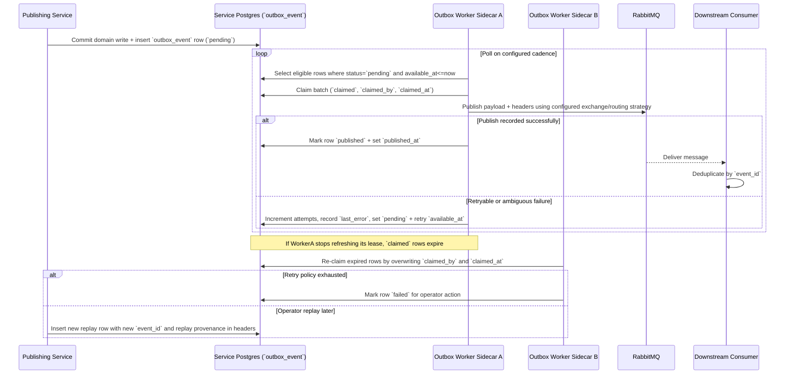

```mermaid
sequenceDiagram
    participant Service as Publishing Service
    participant DB as Service Postgres (`outbox_event`)
    participant WorkerA as Outbox Worker Sidecar A
    participant WorkerB as Outbox Worker Sidecar B
    participant MQ as RabbitMQ
    participant Consumer as Downstream Consumer

    Service->>DB: Commit domain write + insert `outbox_event` row (`pending`)
    loop Poll on configured cadence
        WorkerA->>DB: Select eligible rows where status=`pending` and available_at<=now
        WorkerA->>DB: Claim batch (`claimed`, `claimed_by`, `claimed_at`)
        WorkerA->>MQ: Publish payload + headers using configured exchange/routing strategy
        alt Publish recorded successfully
            WorkerA->>DB: Mark row `published` + set `published_at`
            MQ-->>Consumer: Deliver message
            Consumer->>Consumer: Deduplicate by `event_id`
        else Retryable or ambiguous failure
            WorkerA->>DB: Increment attempts, record `last_error`, set `pending` + retry `available_at`
        end
    end

    Note over WorkerA,DB: If WorkerA stops refreshing its lease, `claimed` rows expire
    WorkerB->>DB: Re-claim expired rows by overwriting `claimed_by` and `claimed_at`
    alt Retry policy exhausted
        WorkerB->>DB: Mark row `failed` for operator action
    else Operator replay later
        Service->>DB: Insert new replay row with new `event_id` and replay provenance in headers
    end
```
